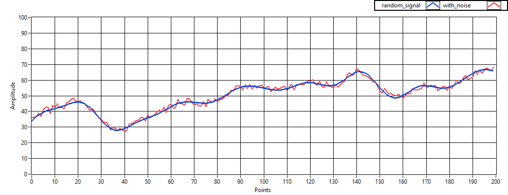

#random_signal_generator

random_signal_generator is a c++ library utility that generates a smooth, random data signal.

Randomly generated signals are useful data sets for testing and tuning algorithms.  Common applications include:
- Machine Learning
- Signal Processing
- Control Theory
- Forecasting

Full documentation can be found at: <https://pcdangio.github.io/doc/utilities/random_signal_generator/index.html>

**License:** [MIT](https://choosealicense.com/licenses/mit/)